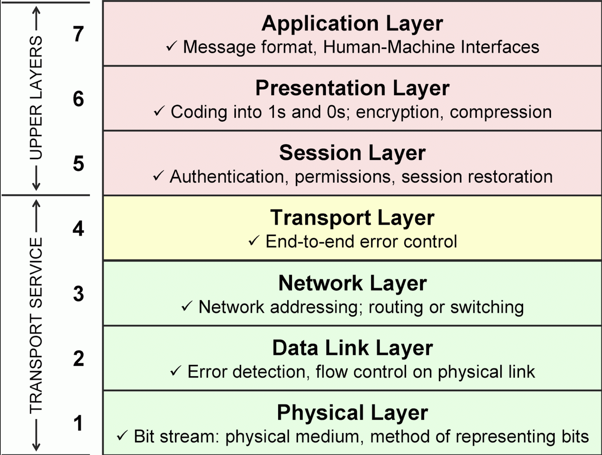

# AWS Services for OSI Layers

The **OSI (Open Systems Interconnection)** model consists of **07 layers**. These layers define how data is transmitted over a network, and each provides specific functions to facilitate communication between devices.

| **OSI Layer** | **Function** | **AWS Services** |
| --- | --- | --- |
| **Layer 1 (Physical)** | Physical transmission of data | Amazon EC2 instances, AWS Direct Connect, Amazon Lightsail |
| **Layer 2 (Data Link)** | Node-to-node data transfer and error handling | Amazon VPC, Elastic Load Balancer, AWS VPN, Route 53 |
| **Layer 3 (Network)** | Routing, packet forwarding | Amazon VPC, AWS Transit Gateway, Route 53, Elastic IPs, CloudFront, Direct Connect |
| **Layer 4 (Transport)** | End-to-end communication and error detection | Elastic Load Balancer (ALB, NLB), AWS Global Accelerator, Amazon CloudWatch, AWS WAF |
| **Layer 5 (Session)** | Session management between devices | AWS App Mesh, API Gateway, AWS Lambda, Amazon Cognito |
| **Layer 6 (Presentation)** | Data translation, compression, encryption | KMS, Secrets Manager, CloudFront, Elastic Transcoder |
| **Layer 7 (Application)** | Network services for applications | Amazon EC2, ALB, API Gateway, Lambda, S3, Elastic Beanstalk, CloudFront, RDS, Fargate, AWS AppSync, DynamoDB |

### 1. **Physical Layer (Layer 1)**:

- **Function**: Deals with the physical transmission of data over a network. This includes the hardware devices and transmission media (cables, wireless signals).
- **Examples**: Ethernet cables, fiber optics, Wi-Fi signals, and network interface cards (NICs).
- **AWS Services**:
    - **Amazon EC2 Instances** (and other compute services): The physical hardware (servers) is abstracted in AWS, but the EC2 instances provide virtualized compute resources that run on this infrastructure.
    - **AWS Direct Connect**: A dedicated network connection from your on-premises data center to AWS, which uses physical lines (fiber or other technologies).
    - **Amazon Lightsail**: A simplified compute service that abstracts virtual private servers with physical infrastructure managed by AWS.

### 2. **Data Link Layer (Layer 2)**:

- **Function**: Responsible for node-to-node data transfer and error correction. It ensures reliable communication over the physical layer by formatting data into frames.
- **Examples**: Ethernet, Wi-Fi (IEEE 802.11), MAC addresses, and switches.
- **AWS Services**:
    - **Amazon VPC (Virtual Private Cloud)**: Provides networking resources like subnets, routing tables, and network interfaces to control traffic between instances.
    - **Elastic Load Balancing (ELB)**: Distributes incoming traffic across multiple targets, such as EC2 instances, ensuring proper flow and high availability.
    - **AWS VPN**: Virtual Private Network that allows secure connections between your on-premises network and AWS VPC, dealing with IPsec tunnels and ensuring secure data transmission.
    - **Amazon Route 53**: A highly available DNS service that helps route traffic to the appropriate resource, leveraging low-level data link functionalities (DNS resolution).

### 3. **Network Layer (Layer 3)**:

- **Function**: Handles routing and forwarding of packets across networks. It determines the best path for data to travel from source to destination.
- **Examples**: IP (Internet Protocol), routers, IPv4, IPv6.
- **AWS Services**:
    - **Amazon VPC**: Allows you to define your IP address range, subnets, route tables, and gateways to control network routing.
    - **AWS Transit Gateway**: Simplifies connecting multiple VPCs and on-premises networks in a hub-and-spoke model.
    - **Amazon Route 53**: A DNS service that manages routing decisions based on domain names.
    - **Elastic IP Addresses (EIP)**: Static IPv4 addresses used for dynamic cloud computing.
    - **AWS Direct Connect**: Establishes dedicated network connections between your on-premises infrastructure and AWS, bypassing the internet for more consistent and secure routing.
    - **Amazon CloudFront**: CDN that ensures content is routed efficiently from edge locations to end users, optimizing delivery performance.

### 4. **Transport Layer (Layer 4)**:

- **Function**: Ensures end-to-end communication and data integrity between hosts. It manages data flow control, error detection, and lost data retransmitting.
- **Examples**: TCP (Transmission Control Protocol), UDP (User Datagram Protocol), port numbers.
- **AWS Services**:
    - **Elastic Load Balancer (ELB)**: Distributes incoming application traffic across multiple targets (e.g., EC2 instances) to ensure availability and fault tolerance.
    - **AWS Global Accelerator**: Improves the availability and performance of your applications by routing traffic through the optimal AWS edge locations.
    - **Amazon CloudWatch**: Monitors application and infrastructure performance, helping you track network-level and transport-level metrics like latency and throughput.
    - **AWS WAF (Web Application Firewall)**: Protects your applications from malicious traffic at the transport layer, filtering HTTP/HTTPS requests.

### 5. **Session Layer (Layer 5)**:

- **Function**: Manages sessions or connections between applications. It controls the dialog between two systems, including starting, maintaining, and terminating connections.
- **Examples**: APIs, RPC (Remote Procedure Call), NetBIOS.
- **AWS Services**:
    - **AWS App Mesh**: A service mesh that manages the communication between microservices, ensuring consistent behavior across services.
    - **Amazon API Gateway**: Enables you to create and manage APIs for your backend services, managing request handling, throttling, and authorization at the session level.
    - **AWS Lambda**: Serverless compute service that enables application logic execution in response to events, often managing sessions and state for short-lived interactions.
    - **Amazon Cognito**: Handles user authentication and session management, including OAuth, SAML, and JWT integration for user sessions.

### 6. **Presentation Layer (Layer 6)**:

- **Function**: Translates data between the application layer and the network. It handles data encoding, compression, and encryption/decryption.
- **Examples**: SSL/TLS (for encryption), JPEG, GIF, ASCII, XML, and JSON encoding.
- **AWS Services**:
    - **AWS Key Management Service (KMS)**: Manages encryption keys for encrypting data, ensuring data is presented securely.
    - **AWS Secrets Manager**: Securely stores and manages secrets, such as database credentials and API keys, ensuring the presentation layer remains secure.
    - **Amazon CloudFront**: Optimizes web content delivery by caching static content at edge locations, ensuring faster data presentation to users.
    - **AWS Elastic Transcoder**: A service that converts media files into different formats, useful for applications that present multimedia data in different ways.

### 7. **Application Layer (Layer 7)**:

- **Function**: Provides network services to end-user applications. This is where communication begins and ends for the user. It defines the protocols and services that applications use to communicate over the network.
- **Examples**: HTTP, FTP, DNS, email protocols (SMTP, IMAP), web browsers, and other networked software.
- **AWS Services**:
    - **Amazon EC2**: Provides compute instances to host web servers, application servers, databases, etc.
    - **Elastic Load Balancing (ALB - Application Load Balancer)**: Routes HTTP/HTTPS traffic at the application level and enables content-based routing to different microservices.
    - **Amazon S3**: Object storage for web application assets (e.g., images, videos, documents), often used as a content repository for web apps.
    - **Amazon API Gateway**: Manages API requests and responses, providing features like request throttling, routing, and transformation for application-layer communication.
    - **AWS Lambda**: Executes application logic in a serverless manner, triggered by events such as HTTP requests, file uploads, or changes in data.
    - **Amazon CloudFront**: A content delivery network (CDN) that caches and delivers application content (images, videos, and data) at low latency from edge locations.
    - **AWS Elastic Beanstalk**: Provides an easy-to-use platform-as-a-service (PaaS) environment for deploying, managing, and scaling web applications and services.
    - **Amazon RDS**: Managed relational databases that store application data.
    - **AWS Fargate**: A serverless compute engine for containers, simplifying containerized application deployment without managing the underlying infrastructure.
